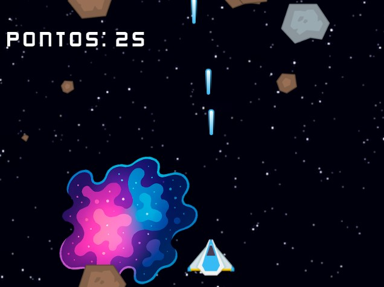

# 🚀 Space Shooter (Go + Ebitengine)

Um jogo simples de **Space Shooter** desenvolvido em **Golang** com a [Ebitengine](https://ebitengine.org/).  
O objetivo principal desse projeto não é criar um game super elaborado, mas sim **praticar e aplicar conceitos de Go** de forma divertida, usando o desenvolvimento de jogos como laboratório.

---

## 🎮 Sobre o Jogo
- Inspirado no clássico **Space Shooter**.
- Movimente a nave, atire contra meteoros e tente alcançar a maior pontuação possível.
- Releitura simples, feita apenas para estudo e diversão.

---

## 🛠️ Tecnologias Utilizadas
- [Golang](https://go.dev/)  
- [Ebitengine](https://ebitengine.org/) — motor 2D para Go  

---

## 🎨 Assets e Sons
- Sprites: [Kenney.nl](https://kenney.nl)  
- Efeitos sonoros: [OpenGameArt](https://opengameart.org/)  

---

## 📺 Referência
Esse projeto foi inspirado pelo vídeo tutorial do canal **Go Lab Tutoriais**:  
[🎥 Como criar um jogo do zero com Golang | Golang tutorial - Iniciantes](https://www.youtube.com/watch?v=BEe4MHDjAyU)

---

## 📸 Screenshots


---

## 🚀 Como Rodar o Projeto

### 🔹 Opção 1: Rodar o executável (mais fácil)
Se você só quer jogar, basta baixar/clonar este repositório e executar o arquivo space-shooter.exe

### 🔹 Opção 2: Rodar via código fonte
Se quiser compilar/rodar o jogo manualmente:
1. Certifique-se de ter o **Go** instalado (versão 1.20 ou superior).  
2. Clone este repositório:
   ```
   git clone https://github.com/JacksomGuilherme/Space-Shooter.git
   cd Space-Shooter
   ````
3. Instale as dependências:
   ```
   go mod tidy
   ````
4. Rode o jogo:
   ```
   go run .
   ```
